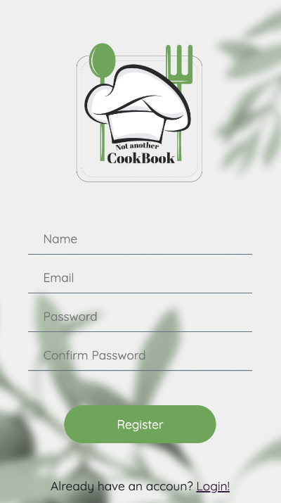

# Not Another CookBook

## What is it?

NotAnotherCookBook is an application made to solve the question "What are we eating today"? and at the same time once the decision is made, to create an accessible shopping list with the ingredients needed.

## What type of data does it use?

- Using Puppeteer to crawl different popular recipe websites, the user has access from the start to hundreds of recipes stored in the database.
- The user has the option to input his own recipes and save them in the application.

## The features

- User can scroll to the existing recipes, can add his/her own to the list;
- User can see full recipe by clicking on the modals (ingredients, portions, nutritional value per serving);
- When there is a recipe that he/she is set on, it can be added to the shopping list;
- The ingredients are then sorted by category (dairy, meat, sauces..etc.) to make the shopping experience faster and easier for the user.

  > Check it on [https://not-another-cookbook.herokuapp.com/](https://not-another-cookbook.herokuapp.com/) *The application is intended for mobile-only

  ## Preview

  ### Login / Signup page

  ### Homepage

  ### Add your own recipe form

 ### List preview page
 

 ### Final list with category sorting
 

# The team

- [Raphael Castagna Haasper](https://github.com/RaphaCH)
- [Georgiana Marcu](https://github.com/georgianamarcu)
- [Clément Vermylen](https://github.com/clementvermylen)
- [Laurent Eyckermans](https://github.com/LaurentEyckermans)
